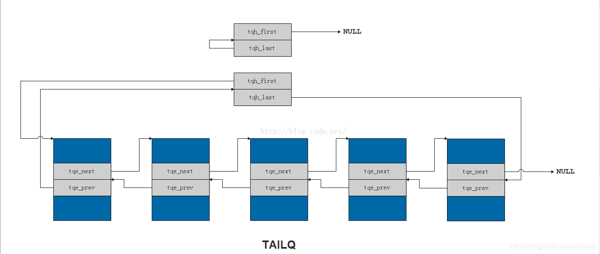

[toc]


## tailq intro

### 设计原理
其中的tqe_prev指向的不是前一个元素，而是前一个元素中的tqe_next，这样定义的一个好处就是*tqe_prev就是自身的地址，**tqe_prev就是自身。

###  Tail queue definitions.

+ TAILQ_HEAD(name, type)
+ TAILQ_ENTRY(type)

用法
```
struct StructName 
{
    int data;
    TAILQ_ENTRY(StructName) entry;
};
TAILQ_HEAD(HeadOfStruct,StructName);
struct HeadOfStruct tailqHead;
```
src
```
#define	_TAILQ_ENTRY(type, qual)					\
struct {								\
	qual type *tqe_next;		/* next element */		\
	qual type *qual *tqe_prev;	/* address of previous next element */\
}
#define TAILQ_ENTRY(type)	_TAILQ_ENTRY(struct type,)

#define	_TAILQ_HEAD(name, type, qual)					\
struct name {								\
	qual type *tqh_first;		/* first element */		\
	qual type *qual *tqh_last;	/* addr of last next element */	\
}
#define TAILQ_HEAD(name, type)	_TAILQ_HEAD(name, struct type,)
```

### Tail queue functions.
+ TAILQ_INIT(head)
+ TAILQ_HEAD_INITIALIZER(head)
+ TAILQ_INSERT_HEAD(head, elm, field)
+ TAILQ_INSERT_TAIL(head, elm, field)
+ TAILQ_INSERT_AFTER(head, listelm, elm, field)
+ TAILQ_INSERT_BEFORE(listelm, elm, field)
+ TAILQ_REMOVE(head, elm, field)
+ TAILQ_FOREACH(var, head, field)
+ TAILQ_FOREACH_REVERSE(var, head, headname, field)
+ TAILQ_CONCAT(head1, head2, field)
```
#define	TAILQ_HEAD_INITIALIZER(head)					\
	{ NULL, &(head).tqh_first }

#define	TAILQ_INIT(head) do {						\
	(head)->tqh_first = NULL;					\
	(head)->tqh_last = &(head)->tqh_first;				\
} while (/*CONSTCOND*/0)

#define	TAILQ_INSERT_HEAD(head, elm, field) do {			\
	if (((elm)->field.tqe_next = (head)->tqh_first) != NULL)	\
		(head)->tqh_first->field.tqe_prev =			\
		    &(elm)->field.tqe_next;				\
	else								\
		(head)->tqh_last = &(elm)->field.tqe_next;		\
	(head)->tqh_first = (elm);					\
	(elm)->field.tqe_prev = &(head)->tqh_first;			\
} while (/*CONSTCOND*/0)

#define	TAILQ_INSERT_TAIL(head, elm, field) do {			\
	(elm)->field.tqe_next = NULL;					\
	(elm)->field.tqe_prev = (head)->tqh_last;			\
	*(head)->tqh_last = (elm);					\
	(head)->tqh_last = &(elm)->field.tqe_next;			\
} while (/*CONSTCOND*/0)

#define	TAILQ_INSERT_AFTER(head, listelm, elm, field) do {		\
	if (((elm)->field.tqe_next = (listelm)->field.tqe_next) != NULL)\
		(elm)->field.tqe_next->field.tqe_prev = 		\
		    &(elm)->field.tqe_next;				\
	else								\
		(head)->tqh_last = &(elm)->field.tqe_next;		\
	(listelm)->field.tqe_next = (elm);				\
	(elm)->field.tqe_prev = &(listelm)->field.tqe_next;		\
} while (/*CONSTCOND*/0)

#define	TAILQ_INSERT_BEFORE(listelm, elm, field) do {			\
	(elm)->field.tqe_prev = (listelm)->field.tqe_prev;		\
	(elm)->field.tqe_next = (listelm);				\
	*(listelm)->field.tqe_prev = (elm);				\
	(listelm)->field.tqe_prev = &(elm)->field.tqe_next;		\
} while (/*CONSTCOND*/0)

#define	TAILQ_REMOVE(head, elm, field) do {				\
	if (((elm)->field.tqe_next) != NULL)				\
		(elm)->field.tqe_next->field.tqe_prev = 		\
		    (elm)->field.tqe_prev;				\
	else								\
		(head)->tqh_last = (elm)->field.tqe_prev;		\
	*(elm)->field.tqe_prev = (elm)->field.tqe_next;			\
} while (/*CONSTCOND*/0)

#define	TAILQ_FOREACH(var, head, field)					\
	for ((var) = ((head)->tqh_first);				\
		(var);							\
		(var) = ((var)->field.tqe_next))

#define	TAILQ_FOREACH_REVERSE(var, head, headname, field)		\
	for ((var) = (*(((struct headname *)((head)->tqh_last))->tqh_last));	\
		(var);							\
		(var) = (*(((struct headname *)((var)->field.tqe_prev))->tqh_last)))

#define	TAILQ_CONCAT(head1, head2, field) do {				\
	if (!TAILQ_EMPTY(head2)) {					\
		*(head1)->tqh_last = (head2)->tqh_first;		\
		(head2)->tqh_first->field.tqe_prev = (head1)->tqh_last;	\
		(head1)->tqh_last = (head2)->tqh_last;			\
		TAILQ_INIT((head2));					\
	}								\
} while (/*CONSTCOND*/0)

```
### Tail queue access methods.

```
#define	TAILQ_EMPTY(head)		((head)->tqh_first == NULL)
#define	TAILQ_FIRST(head)		((head)->tqh_first)
#define	TAILQ_NEXT(elm, field)		((elm)->field.tqe_next)

#define	TAILQ_LAST(head, headname) \
	(*(((struct headname *)((head)->tqh_last))->tqh_last))
#define	TAILQ_PREV(elm, headname, field) \
	(*(((struct headname *)((elm)->field.tqe_prev))->tqh_last))
```
#### TAILQ_LAST(head, headname) 实现
**TAILQ_LAST**的目的是获取队列中的最后一个元素的地址，注意是地址哦！`(head)->tqh_last`代表的是最后一个元素中`tqe_next`的地址，通过强转之后，`((struct headname *)((head)->tqh_last))->tqh_last`,tqe_next 向后偏移一个指针，实际上就是最后一个元素中的`tqe_prev`，而文章一开始介绍定义的时候就说过，`*tqe_prev`代表的是自身元素的地址，所以TAILQ_LAST最后获取的就是最后一个元素的地址，宏TAILQ_PREV的道理是一样的。


