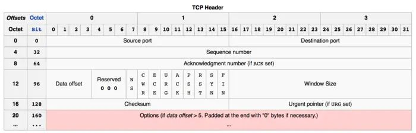
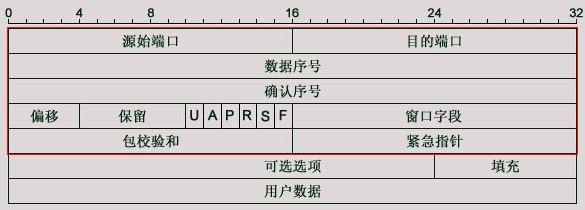
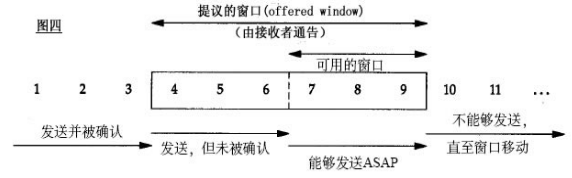

## 1. TCP头部分析与确认号的理解

+ **源端口号和目的端口号**：再加上Ip首部的源IP地址和目的IP地址可以唯一确定一个TCP连接
+ **数据序号**：表示在这个报文段中的第一个数据字节序号
+ **确认序号**：仅当ACK标志为1时有效。确认号表示期望收到的下一个字节的序号（这个下面再详细分析）
+ **偏移**：就是头部长度，有4位，跟IP头部一样，以4字节为单位。最大是60个字节
+ **保留位**：6位，必须为0
+ 6个标志位：
1. URG-紧急指针有效
2. ACK-确认序号有效
3. PSH-接收方应尽快将这个报文交给应用层
4. RST-连接重置
5. SYN-同步序号用来发起一个连接
6. FIN-终止一个连接

+ **窗口字段**：16位，代表的是窗口的字节容量，也就是TCP的标准窗口最大为2^16 - 1 = 65535个字节（这个下面再详细分析）

+ **校验和**：源机器基于数据内容计算一个数值，收信息机要与源机器数值 结果完全一样，从而证明数据的有效性。检验和覆盖了整个的TCP报文段：这是一个强制性的字段，一定是由发送端计算和存储，并由接收端进行验证的。

+ **紧急指针**：是一个正偏移量，与序号字段中的值相加表示紧急数据最后一个字节的序号。TCP的紧急方式是发送端向另一端发送紧急数据的一种方式
+ **选项与填充**（必须为4字节整数倍，不够补0）：
最常见的可选字段的最长报文大小MSS（Maximum Segment Size），每个连接方通常都在一个报文段中指明这个选项。它指明本端所能接收的最大长度的报文段。
该选项如果不设置，默认为536（20+20+536=576字节的IP数据报）

## 2.TCP如何保证可靠性

* 1）应用数据被分割成TCP认为最合适发送的数据块。称为段（Segment）传递给IP层
* 2）当TCP发出一个段后，它会启动一个定时器，等待目的端确认收到这个报文段。若没有及时收到确认，将重新发送这个报文段
* 3）当TCP收到发自TCP连接另一端的数据，它将发送一个确认。这个确认不是立即发送的，通常将推迟几分之一秒。
* 4）TCP将保持它首部和数据的校验和，这是一个端到端的校验和，目的是检测数据在传输过程中的任何变化。如果收到段的校验和有差错，TCP将丢弃这个报文也不进行确认（对方就会重复发送了）。
* 5）TCP承载与IP数据报来传输，而IP数据报可能会失序，所以TCP的报文段到达时也可能会失序。但是TCP收到数据后会重新排序到正确的顺序（通过序号）。
* 6）IP数据报会发生重复，TCP的接收端必须丢弃重复是数据
* 7）TCP还能提供流量控制，TCP连接的每一方都有一定大小的缓冲空间

## 3. 滑动窗口协议（也就是对包头中窗口字段的理解）

参考1：https://www.cnblogs.com/ulihj/archive/2011/01/06/1927613.html

参考2：http://blog.chinaunix.net/uid-26275986-id-4109679.html

先上两个概念：
通告接收窗口（rwnd）：预防应用程序发送的数据超过对方的缓冲区，接收方使用的流量控制。
拥塞窗口（cwnd）：预防应用程序发送的数据超过了网络所能承载的能力。发送方使用的流量控制。
发送窗口：就是指上面两者的较小值

由于TCP的全双工的，所以其实TCP双方各自都维护一个发送窗口和接收窗口。

假设是主机A发送给主机B
A和B都会维护一个数据帧的序列，这个序列称为窗口。发送方的窗口大小由接收方确定。目的在于控制发送速度。以免接收方的缓存不够大而导致溢出，同时流量控制也可以避免网络拥塞。
这里其实是指A的发送窗口。

## 4.关于包头中确认号ack的理解

 确认序号：仅当ACK标志为1时有效。确认号表示期望收到的下一个字节的序号
这里是拿三次握手之后，开始传输数据了进行分析。
服务器向客户端发送一个数据包后，客户端收到了这个数据包，会向服务器发送一个确认数据包。

### 传输数据的简要过程如下：

1）发送数据：服务器向客户端发送一个带有数据的数据包。该数据包中的序列号和确认号与建立连接第三步的数据包找那个的序列号和确认号相同。

2）确认收到：客户端收到该数据包，向服务器发送一个确认数据包。该数据包中，序列号是为上一个数据包中的确认号值。

而确认号为服务器发送的上一个数据包中的序列号+该数据包中所带数据的大小。

回复确认收到的ack = 收到了序列号 + 数据的大小（同时也表示下一次期望收到的序号）

### nc 测试交互过程的sn、ack 变化

服务端监听本地端口3000

`nc -lv localhost 3000`

客户端连接本地端口 3000

`nc -v localhost 3000`

tcpdump 查看交互消息

`tcpdump -pnv -i lo port 3000`